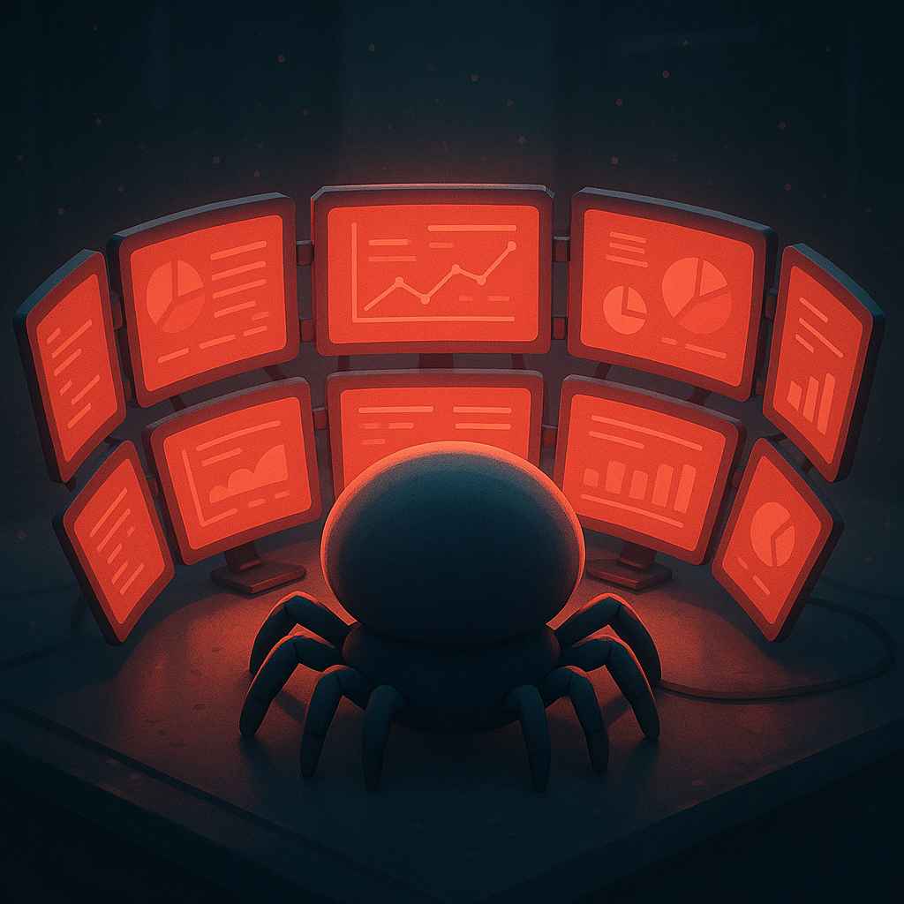

<!-- Profile Picture -->

  

<h1 align="center">Hi, I'm Aryan 👋</h1>

  <strong>Computer Science Student @ University of Manitoba</strong> 
  Building impactful software, exploring emerging technologies, and seeking opportunities to contribute to innovative teams.

---

## 🚀 Featured Projects

- **[CyberSentinel](https://github.com/Aryan0826/CyberSentinel)** – Chrome extension + Flask dashboard (VirusTotal API) for real-time link scanning with a privacy-first design.  
- **[Discord Verification Bot](https://github.com/Aryan0826/BookClub-Bot)** – Automated member verification bot for a university book club, deployed on Railway.  
- **[HackAJudge](https://github.com/Aryan0826/HackAJudge)** – Real-time hackathon judging and leaderboard platform built with Flask + JavaScript.  
- **[Cooked](https://github.com/Aryan0826/Cooked)** – Award-winning 2D cooking game (Godot, GDScript) developed in 48 hours for a Game Jam.

---

## 🛠️ Skills

**Languages:** Python, Java, C++, JavaScript, SQL, HTML/CSS  
**Frameworks & Tools:** Flask, React, Node.js, Git, PostgreSQL, Linux  
**Core Areas:** Web Development, API Integration, Data Structures & Algorithms

---

## 🏆 Achievements

- Winner – Cybersecurity Bootcamp Project (*CyberSentinel*)  
- Winner – Game Jam (*Cooked*, People’s Choice Award)  
- Academic Scholarship – Excellence in Computer Science  

---

## 📊 GitHub Overview

  
  

  

---

## 🎯 Career Interests

- Actively seeking **Summer 2026 Software Engineering Internships**  
- Passionate about **backend systems, web development, and API integrations**  
- Excited to collaborate on **open-source and impactful software projects**

---

## 🌐 Connect

- **Email:** vekariyaaryan100@gmail.com  
- **GitHub:** [github.com/Aryan0826](https://github.com/Aryan0826)  
- **LinkedIn:** [aryan-vekariya-b66663262](https://www.linkedin.com/in/aryan-vekariya-b66663262/)

---

  <em>Always curious. Always building.</em>

